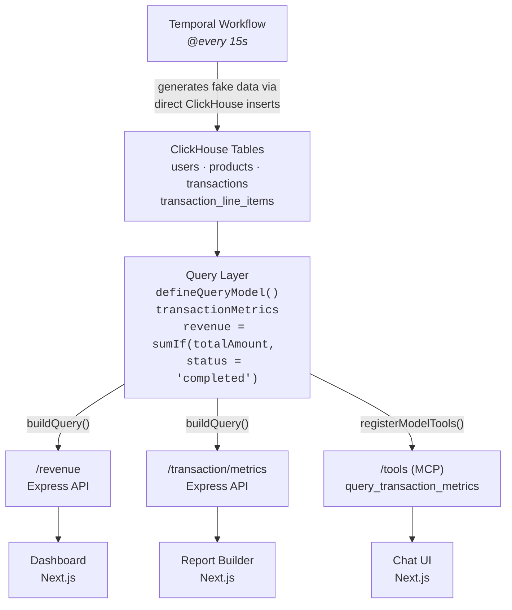
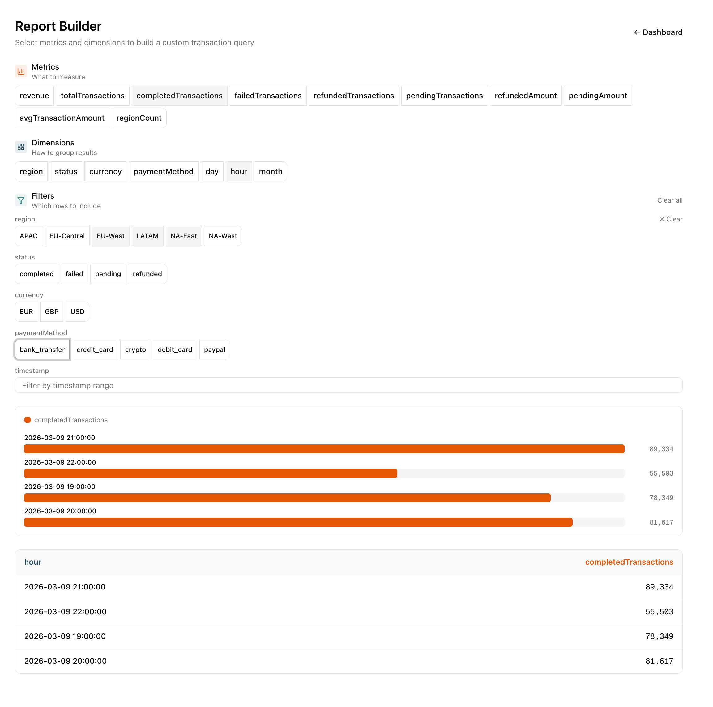

# Financial Query Layer Demo

A financial services data surface with two access patterns over the same ClickHouse data:

1. **MCP** — AI chat with free SQL generation via the Model Context Protocol
2. **Dashboard** — hand-crafted Express API endpoints powering a Next.js revenue dashboard
3. **Report Builder** — interactive query builder UI powered by `buildQuery()` with selectable metrics, dimensions, and filters

Companion demo for the blog post [Define Once, Use Everywhere](https://docs.fiveonefour.com/guides/chat-in-your-app/tutorial). Built with [MooseStack](https://docs.fiveonefour.com).

| Without query layer ([`7da601e`](https://github.com/514-labs/financial-query-layer-demo/tree/7da601e)) | With query layer (`main`) |
|---|---|
|  |  |
| AI generates SQL against raw tables — misses `WHERE status = 'completed'`, inflating revenue. Dashboard and chat show different numbers. | Revenue is defined once as `sumIf(totalAmount, status = 'completed')`. Dashboard, chat, and any future surface all use the same metric definition. |

## Quickstart

### Prerequisites

- Node.js v20+ and pnpm v8+
- Docker Desktop (running)
- Moose CLI: `bash -i <(curl -fsSL https://fiveonefour.com/install.sh) moose`
- [Anthropic API key](https://console.anthropic.com/) (for chat)

### Setup

```bash
pnpm install

cp packages/moosestack-service/.env.{example,local}
cp packages/web-app/.env.{example,local}
```

Generate auth tokens:

```bash
cd packages/moosestack-service
moose generate hash-token
```

Set environment variables (`moose generate hash-token` outputs a key pair — hash goes to backend, token goes to frontend):

| Variable | File | Value |
|---|---|---|
| `MCP_API_KEY` | `packages/moosestack-service/.env.local` | `ENV API Key` (hash) from `moose generate hash-token` |
| `MCP_API_TOKEN` | `packages/web-app/.env.local` | `Bearer Token` from `moose generate hash-token` |
| `ANTHROPIC_API_KEY` | `packages/web-app/.env.local` | Your [Anthropic API key](https://console.anthropic.com/) |

### Run

```bash
pnpm dev          # Both services
pnpm dev:moose    # Backend only
pnpm dev:web      # Frontend only
```

- Dashboard: http://localhost:3000
- Report Builder: http://localhost:3000/builder
- Revenue API: http://localhost:4000/revenue/by-region
- Transaction Metrics API: http://localhost:4000/transaction/metrics
- MCP endpoint: http://localhost:4000/tools
- Temporal UI: http://localhost:8080

### Ports

Make sure the following ports are free before running `pnpm dev`. Change them in `packages/moosestack-service/moose.config.toml` if needed.

| Service | Port |
|---|---|
| Next.js web app | 3000 |
| MooseStack HTTP/MCP | 4000 |
| Management API | 5001 |
| Temporal | 7233 |
| Temporal UI | 8080 |
| ClickHouse HTTP | 18123 |
| ClickHouse native | 9000 |

## Data Architecture



Compare with the [pre-query-layer architecture (`7da601e`)](https://github.com/514-labs/financial-query-layer-demo/blob/7da601e/README.md#data-architecture), where the dashboard used hand-written SQL and the MCP server exposed free-form `query_clickhouse` with no shared metric definitions.

**Workflow → Tables**: A Temporal workflow runs every 15 seconds, generating ~1k transactions and ~5k line items per run with randomized volumes, weighted status distributions, and price variation.

**Tables → Query Layer**: The `transactionMetrics` query model defines revenue as `sumIf(totalAmount, status = 'completed')` — the single source of truth for all metric calculations.

**Query Layer → Dashboard API**: The `/revenue` Express endpoint uses `buildQuery(transactionMetrics)` to query ClickHouse. The dashboard renders the results with tooltips showing the metric definition.

**Query Layer → Report Builder API**: The `/transaction/metrics` endpoint accepts dynamic `metrics`, `dimensions`, and `filter.*` query params, all resolved through `buildQuery()`. The report builder UI at [`/builder`](http://localhost:3000/builder) lets users pick any combination of metrics and dimensions interactively.

The report builder discovers its UI dynamically from the query model via `/transaction/schema` — adding a new metric, dimension, or filter to `transactionMetrics` in [`transaction-metrics.ts`](packages/moosestack-service/app/query-models/transaction-metrics.ts) automatically makes it available in the report builder with no frontend changes. Filter values (e.g. regions, currencies) are fetched as `DISTINCT` values from ClickHouse at schema load time.



**Query Layer → MCP**: The `/tools` MCP server registers `query_transaction_metrics` via `registerModelTools()`. The AI chat calls this tool instead of writing free-form SQL, ensuring it uses the same metric definitions as the dashboard.

## Schema Design

See [SCHEMA.md](SCHEMA.md) for full table schemas, column types, and ordering keys.

## Metrics Reference

See [METRICS.md](METRICS.md) for the full metrics layer reference — all metrics, dimensions, filters, and consumption patterns.

<!-- TODO: Add metrics reference content to README or expand METRICS.md with usage examples -->

## Connecting MCP Clients

The MCP server at `/tools` exposes `query_clickhouse` and `get_data_catalog`. Connect any MCP client:

### Claude Code

```bash
claude mcp add --transport http moose-tools http://localhost:4000/tools --header "Authorization: Bearer <your_bearer_token>"
```

### mcp.json (Cursor, Claude Desktop, etc.)

```json
{
  "mcpServers": {
    "moose-tools": {
      "transport": "http",
      "url": "http://localhost:4000/tools",
      "headers": {
        "Authorization": "Bearer <your_bearer_token>"
      }
    }
  }
}
```

Replace `<your_bearer_token>` with the Bearer Token from `moose generate hash-token`.

## Troubleshooting

### Port Already in Use

Update `packages/moosestack-service/moose.config.toml`:

```toml
[http_server_config]
port = 4001
```

### "ANTHROPIC_API_KEY not set"

Add your key to `packages/web-app/.env.local` and restart the Next.js dev server.

### CORS Errors

Ensure the MooseStack backend is running — the `/revenue` API includes CORS middleware for cross-origin requests from the frontend.

## Learn More

- [Chat in Your App Tutorial](https://docs.fiveonefour.com/guides/chat-in-your-app/tutorial)
- [MooseStack Documentation](https://docs.fiveonefour.com)
- [Model Context Protocol](https://modelcontextprotocol.io)
